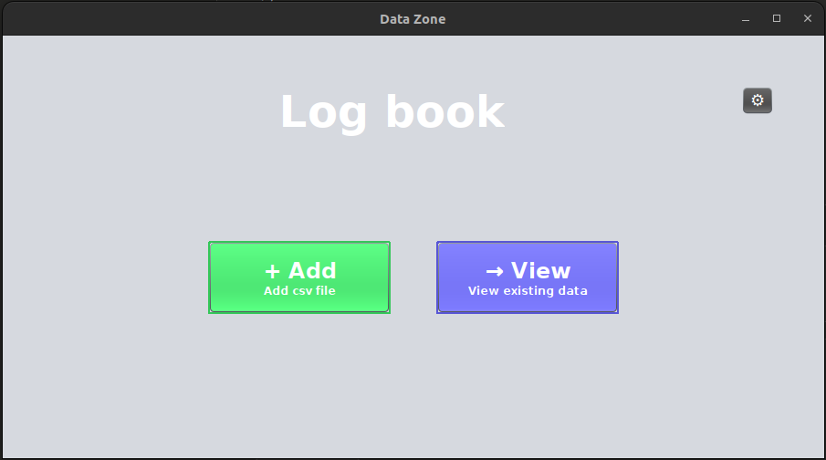
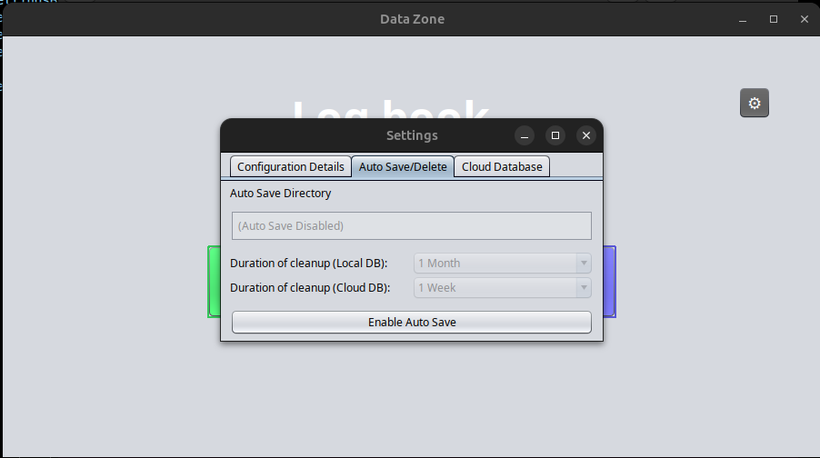
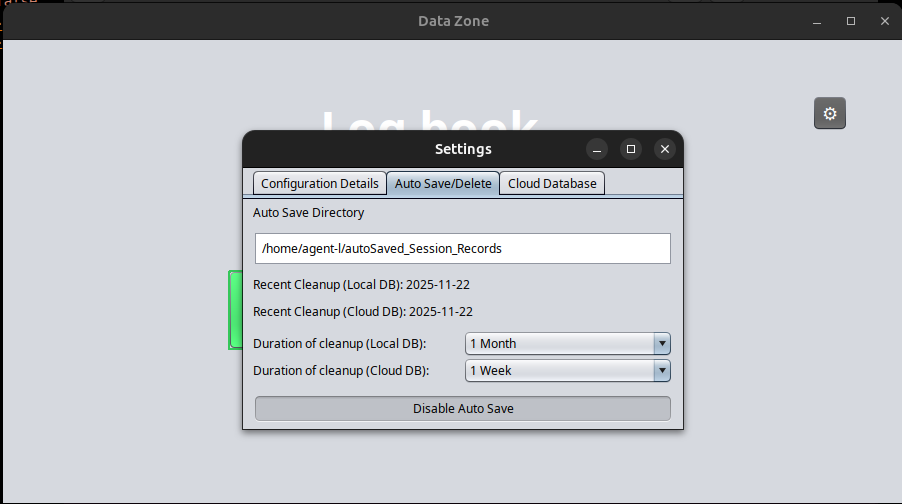

# 📚 DigiLogBook

<div align="center">


**A modern desktop application for managing lab session logbooks with cloud synchronization**

[Features](#-features) • [Installation](#-installation) • [Usage](#-usage) • [Configuration](#%EF%B8%8F-configuration) • [Screenshots](#-screenshots) • [Contributing](#-contributing)

</div>

---

### 🔗 Project Structure
DigiLogBook is a distributed system consisting of two main components:

* **Server - DigiLogBook (This Repo):** Developed by ([@mohammedrayyan12](https://github.com/mohammedrayyan12)). It manages the cloud integration, data persistence, and fail-safe synchronization logic.
* **Client - Session Tracker:** Developed by ([@CodingMirage](https://github.com/CodingMirage)). It provides the desktop user interface for student attendance and local log entry.

**Client Repository:** [Session-Tracker-Client](https://github.com/CodingMirage/JavaSwing-SessionTracker)

---

## 🎯 Overview

**DigiLogBook** is a comprehensive Java Swing desktop application designed for educational institutions to manage student lab session records efficiently. It provides an intuitive interface for importing, viewing, filtering, and exporting lab attendance data with automatic cloud backup capabilities.

### 🎓 Perfect For:
- University computer labs
- Educational institutions
- Training centers
- Any organization tracking session-based attendance

---

## 🎯 What's New in v2.0 (The SQL Migration)

The application has migrated from flat-file storage (`optionsData.csv`) to a **Relational Configuration Engine**. This allows for:
- **Dynamic Category Management**: Add or remove fields like "Department" or "Subjects" directly from the UI without restarting.
- **Universal SQL Dialects**: Auto-detects and supports PostgreSQL (Supabase), MySQL, SQLite, MSSQL, and Oracle using a smart dialect switcher.

---

## ✨ Features

### 📊 **Data Management**
- **CSV Import**: Bulk import session records from CSV files
- **Smart Grouping**: Automatically groups sessions by date, time slot, subject, department, semester, and batch
- **Advanced Filtering**: Filter records by multiple criteria (department, semester, batch, subject, date range, time slots)
- **In-Memory Processing**: Fast temporary data storage for quick operations

### ☁️ **Universal Cloud Synchronization**
- **Dialect Auto-Detection**: Automatically switches SQL syntax (e.g., `SERIAL` vs `AUTO_INCREMENT`) based on your JDBC connection.
- **Dual Database Support**: Local SQLite + Remote MySQL/PostgreSQL cloud database
- **Automatic Sync**: Seamlessly synchronize data between local and cloud storage
- **Connection Verification**: Test and verify cloud database credentials before saving

### 📊 **Dynamic Data Management**
- **Category Manager**: A dedicated interface to manage the organizational structure of your logs.
- **Smart Grouping**: Sessions are dynamically grouped by the categories you define.
- **Advanced Filtering**: Filter records based on your custom-defined batches, semesters, or subjects.

### 💾 **Export Capabilities**
- **Multiple Formats**: Export to CSV or professionally formatted PDF
- **Selective Export**: Choose specific session groups to export
- **Custom PDF Layout**: Beautifully formatted PDF reports with headers and tables

### 🔄 **Automation Features**
- **Auto-Save**: Automatically backup records before deletion
- **Scheduled Cleanup**: Configurable auto-delete based on data age
  - Local Database: Monthly cleanup (1-12 months)
  - Cloud Database: Weekly cleanup (1-4 weeks)
- **Smart Scheduling**: Background task runs daily to check cleanup conditions

### 🎨 **User Interface**
- **Modern Design**: Clean, intuitive Nimbus Look & Feel
- **Interactive Calendar**: Custom date picker for easy date selection
- **Expandable Groups**: Collapsible session groups for better data organization
- **Responsive Layout**: Adapts to different screen sizes

### 🔒 **Security & Safety**
- **Testing Mode**: Disable deletions during development/testing
- **Configuration Files**: Persistent settings stored securely
- **Validation**: Input validation and error handling throughout

---

## 🚀 Installation

### Prerequisites
- **Java Runtime Environment (JRE) 11 or higher**
- **MySQL/PostgreSQL** (for cloud)

### Quick Start

#### Option 1: Run from JAR (Recommended)
```bash
# Download the latest release
# Double-click DigiLogBook-v<VERSION_NUMBER>.jar or run:
java -jar DigiLogBook-v<VERSION_NUMBER>.jar
```

#### Option 2: Build from Source
```bash
# Clone the repository
git clone https://github.com/mohammedrayyan12/JavaSwing-DigiLogBook.git
cd JavaSwing-DigiLogBook

# Compile with dependencies
javac -cp ./lib/pdfbox-app-3.0.5.jar:./lib/sqlite-jdbc-3.50.3.0.jar:./lib/mysql-connector-j-9.3.0.jar:. *.java

# Run the application
java -cp ./lib/mysql-connector-j-9.3.0.jar:./lib/pdfbox-app-3.0.5.jar:./lib/sqlite-jdbc-3.50.3.0.jar:. logBookData
```

### 📦 Dependencies
| Library | Version | Purpose |
|---------|---------|---------|
| SQLite JDBC | 3.50.3.0 | Local database operations |
| MySQL Connector | 9.3.0 | Cloud database connectivity |
| Apache PDFBox | 3.0.5 | PDF generation |

---

## 📖 Usage

### 1️⃣ **First Launch**
On first run, the application creates:
- Configuration directory: `~/.DigiLogBook/`
- Config file: `config.properties`
- Local database: `data.db`

### 2️⃣ **Import Session Data**
1. Click **"+ Add"** button
2. Select CSV file(s) containing session records
3. Data is loaded into temporary in-memory database

**CSV Format:**
```csv
Login Time,USN,Name,Sem,Dept,Subject,Batch, ... , Logout Time,Session ID
2024-11-20T08:30:15,1VI21CS001,John Doe,3,CSE,Data Structures,I, ... , 2024-11-20T10:10:45,session_001
```
### 3️⃣ **View & Filter Data**
1. **Access Records**: Click the **"→ View"** button from the main dashboard to load the records interface.
2. **Dynamic Filtering**: The filtering system is now fully automated based on your `CONFIGURATION_TABLE`.
   * **Custom Categories**: Any new category added (e.g., "Lab Assistant", "Cabin No") will automatically generate a corresponding dropdown filter in the UI.
   * **Multi-Criteria Filtering**: Combine multiple dynamic attributes to narrow down specific lab sessions efficiently.
3. Click **"Select Date/Time"** for advanced filtering:
   - Match specific date or date range
   - Match specific time slot or time range
   - Select "All" to view everything

### 4️⃣ **Export Records**
1. Click **"Export"** button
2. Select session groups using checkboxes
3. Choose format: PDF or CSV
4. Pick save location

### 5️⃣ **Manage Configuration Tables**
This section allows you to customize the organizational structure of the logbook without touching the code:

* **Dynamic Categories**: Navigate to `Settings` → **Configuration Details** tab. Use the **"+ Add / Remove Categories"** button to create new structural keys like "Lab Assistant," "Room No," or "System ID."
* **Reference Items**: Within each category, use the **"Manage [Category]"** dialog to search, add, or delete specific selectable values (e.g., adding a new Subject Code like `BXLX101`).
* **Instant Sync**: Saving these changes triggers a real-time UI refresh, ensuring all dropdowns and filters throughout the app are updated immediately.

### 6️⃣ **Configure Cloud Sync** 
1. Click ⚙️ **Settings** icon
2. Go to **"Cloud Database"** tab
3. Click **"Add Cloud Database Info"**
4. Enter:
   - JDBC URL (e.g., `jdbc:mysql://host:3306/database`)
   - Username
   - Password
   * **Universal SQL Sync**: Simply provide a cloud JDBC URL; the system's **Universal SQL Engine** auto-detects the database provider (Supabase, MySQL, MSSQL, etc.) and initializes the optimized schema (Configuration Table and Records Table) automatically.

5. Click **"Verify and Save"**

### 7️⃣ **Setup Auto-Save/Delete**
1. Go to Settings → **"Auto Save/Delete"** tab
2. Click **"Enable Auto Save"**
3. Select auto-save directory
4. Configure cleanup duration:
   - Local DB: 1-12 months
   - Cloud DB: 1-4 weeks

---

## ⚙️ Configuration

### config.properties
Located at: `~/.DigiLogBook/config.properties`

```properties
# Database Configuration
LOCAL_TABLE=student_log
CLOUD_TABLE=sessions
JDBC_URL_local=data.db
JDBC_URL_cloud=jdbc:mysql://localhost:3306/logbook
JDBC_USERNAME_cloud=your_username
JDBC_PASSWORD_cloud=your_password
CLOUD_DB_VERIFIED=true

# Auto-Save/Delete Settings
auto.save=true
auto.save.records.directory=/path/to/backup
local.auto.delete.duration=3
cloud.auto.delete.duration=2
local.auto.delete.last.run.date=2024-11-20
cloud.auto.delete.last.run.date=2024-11-20

# Testing/Development
testing.skip.delete=false
```
---

## 📸 Screenshots

### Main Interface
<div align="center">

<p><i>Clean main interface with Add and View options</i></p>
</div>

### Settings Dialog
<div align="center">

<p><i>Auto Save/Delete disabled state</i></p>


<p><i>Auto Save/Delete enabled with testing mode indicator</i></p>
</div>

### Data View
<div align="center">

<p><i>Filtered session groups with expand/collapse functionality</i></p>
</div>

---

## 🏗️ Technical Architecture

```
DigiLogBook/
├── logBookData.java          # Main application entry point
├── DataPlace.java            # UI and data coordination
├── AddLogbookManager.java    # In-memory database management
├── DataGrouper.java          # Session grouping logic
├── UIGroupDisplay.java       # Display components
├── Utils.java                # Utility classes (Config, Export, DatePicker)
├── autoDelete.java           # Scheduled cleanup tasks
├── lib/                      # External libraries
│   ├── sqlite-jdbc-3.50.3.0.jar
│   ├── mysql-connector-j-9.3.0.jar
│   └── pdfbox-app-3.0.5.jar
└── config.properties         # Application configuration
```

### Database Schema (Universal)
The system now uses a dynamic schema that adapts its data types to the connected database:

**Table: CONFIGURATION_TABLE**
| Column | Type | Description |
|--------|------|-------------|
| id | Primary Key | Auto-incremented (Dialect specific) |
| category | String | The reference type (e.g., 'Subject', 'Dept') |
| item_value | String | The actual value (e.g., 'Data Structures') |


**Table: student_log / sessions**
| Column | Type | Description |
| :--- | :--- | :--- |
| **session_id** | String (PK) | Unique identifier for the lab session (UUID/String) |
| **login_time** | Text/String | Timestamp of student entry |
| **logout_time** | Text/String | Timestamp of student exit |
| **usn** | Text/String | University Seat Number of the student |
| **name** | Text/String | Full name of the student |
| **details** | JSON/LongText | Stores all dynamic attributes (Subject, Dept, Sem, etc.) in a JSON string |

---

## 🛠️ Development

### Building the Project
```bash
# Compile all Java files
javac -cp ./lib/pdfbox-app-3.0.5.jar:./lib/sqlite-jdbc-3.50.3.0.jar:./lib/mysql-connector-j-9.3.0.jar:. *.java

# Run with all dependencies
java -cp ./lib/mysql-connector-j-9.3.0.jar:./lib/pdfbox-app-3.0.5.jar:./lib/sqlite-jdbc-3.50.3.0.jar:. logBookData
```

### Testing Mode
Enable testing mode to prevent data deletion during development:
```properties
# In config.properties
testing.skip.delete=true
```

### Creating Executable JAR
```bash
# Create JAR with dependencies
jar cvfm DigiLogBook.jar manifest.txt *.class lib/
```

**manifest.txt:**
```
Main-Class: logBookData
Class-Path: lib/sqlite-jdbc-3.50.3.0.jar lib/mysql-connector-j-9.3.0.jar lib/pdfbox-app-3.0.5.jar
```

---

## 🤝 Contributing

Contributions are welcome! Here's how you can help:

1. **Fork** the repository
2. **Create** a feature branch (`git checkout -b feature/AmazingFeature`)
3. **Commit** your changes (`git commit -m 'Add some AmazingFeature'`)
4. **Push** to the branch (`git push origin feature/AmazingFeature`)
5. **Open** a Pull Request

### Development Guidelines
- Follow existing code style and conventions
- Add comments for complex logic
- Test thoroughly before submitting
- Update documentation as needed

---

## 🐛 Known Issues & Roadmap

### Current Limitations
- ⚠️ Cloud database password stored in config file (encryption planned)
- ⚠️ No multi-user concurrent access handling
- ⚠️ Limited to single-window interface

### Future Enhancements
- 🔐 Password encryption for cloud credentials
- 📧 Email notifications for scheduled tasks
- 🔍 Advanced search and query builder
- 🔄 Real-time cloud sync
- 👥 User authentication and roles

---

## 📄 License

This project is licensed under the **MIT License** - see the [LICENSE](LICENSE) file for details.

```
MIT License

Copyright (c) 2025 mohammedrayyan12

Permission is hereby granted, free of charge, to any person obtaining a copy
of this software and associated documentation files (the "Software"), to deal
in the Software without restriction, including without limitation the rights
to use, copy, modify, merge, publish, distribute, sublicense, and/or sell
copies of the Software...
```

---

## 👨‍💻 Author

**Mohammed Rayyan**

- GitHub: [@mohammedrayyan12](https://github.com/mohammedrayyan12)
- Project Link: [https://github.com/mohammedrayyan12/JavaSwing-DigiLogBook](https://github.com/mohammedrayyan12/JavaSwing-DigiLogBook)

---

## 🙏 Acknowledgments

- **Apache PDFBox** - PDF generation library
- **SQLite** - Lightweight local database
- **MySQL Connector/J** - Cloud database connectivity
- **Nimbus Look & Feel** - Modern UI appearance

---

## 📞 Support

If you encounter any issues or have questions:

1. Check the [Issues](https://github.com/mohammedrayyan12/JavaSwing-DigiLogBook/issues) page
2. Create a new issue with:
   - Detailed description
   - Steps to reproduce
   - System information (OS, Java version)
   - Error logs (if applicable)

---

<div align="center">

**⭐ If you find this project useful, please consider giving it a star! ⭐**

Made with ❤️ for educational institutions

</div>