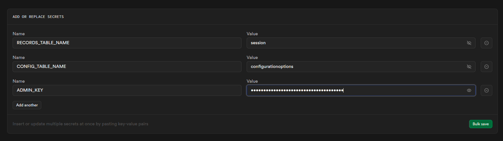
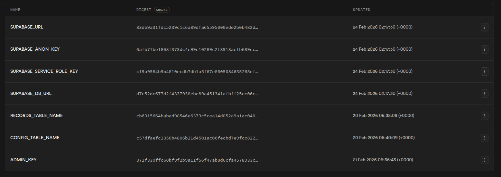
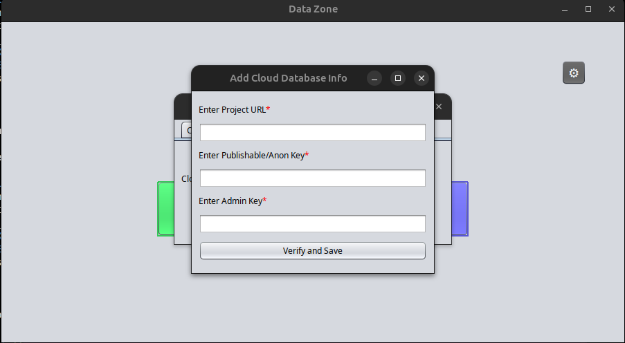
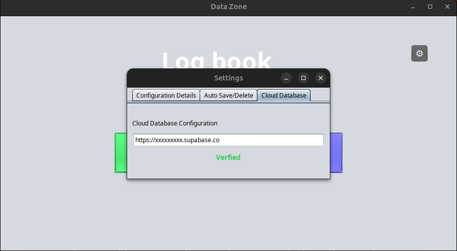

# 🗄️ Supabase Cloud Setup Guide

<div align="center">


**Complete guide to setting up Supabase for DigiLogBook**

[Prerequisites](#-prerequisites) • [Create Project](#-step-1-create-supabase-project) • [Deploy Edge Functions](#-step-2-deploy-edge-functions) • [Configure Secrets](#-step-3-configure-edge-function-secrets) • [Connect App](#-step-4-connect-digilogbook)

</div>

---

## 📋 Prerequisites

Before you begin:

- ✅ A [Supabase account](https://supabase.com) (free tier works perfectly)
- ✅ DigiLogBook application installed
- ✅ Internet connection
- ✅ 10-15 minutes to complete setup

---

## 🚀 Step 1: Create Supabase Project

### 1.1 Sign Up / Login

1. Go to [supabase.com](https://supabase.com)
2. Click **"Start your project"**
3. Sign in with GitHub, Google, or email

### 1.2 Create New Project

1. Click **"New Project"** in your dashboard
2. Fill in project details:
   - **Name**: `DigiLogBook` (or your preferred name)
   - **Database Password**: Create a strong password (**save this!**)
   - **Region**: Choose closest to your location
   - **Pricing Plan**: Free tier is sufficient

3. Click **"Create new project"**
4. Wait 2-3 minutes for project initialization

> **💡 Note**: You don't need to remember the database password for DigiLogBook - it only uses Edge Functions, not direct database connections!

### 1.3 Note Your Connection Details

Once created, you'll need these from your Supabase dashboard:

1. **Project URL**: 
   - Go to **Settings** → **API**
   - Copy **Project URL** (e.g., `https://xxxxx.supabase.co`)

2. **Anon/Public Key**:
   - Same page (**Settings** → **API**)
   - Copy **anon** `public` key

> **📝 Important**: Keep these handy - you'll need them to configure DigiLogBook!

---

## 🔌 Step 2: Deploy Edge Functions

DigiLogBook uses **Supabase Edge Functions** instead of direct database connections for better security and serverless architecture.

### 2.1 Grant Database Permissions

1. **Open SQL Editor**
   - In Supabase dashboard, click **"SQL Editor"** (left sidebar)
   - Click **"+ New query"**

2. **Run Permission Script**
   - Navigate to your DigiLogBook repository
   - Open `Edge Functions/database-schema.sql`
   - Copy the **entire SQL script**
   - Paste it into the SQL Editor
   - Click **"Run"** (or press `Ctrl+Enter`)

3. **What This Does**
   - Grants Edge Functions permission to create and manage tables
   - Sets up Row Level Security (RLS) policies
   - **Does NOT create tables** - those are auto-created by the app!

> **✅ Success Indicator**: You should see "Success. No rows returned"

**Script Location**: [`Edge Functions/database-schema.sql`](https://github.com/mohammedrayyan12/JavaSwing-DigiLogBook/blob/main/Edge%20Functions/database_setup.sql)

### 2.2 Deploy Edge Functions (If Using Supabase CLI)

Supabase Edge Functions are managed via the **Supabase CLI**. While you can see the functions in the Supabase Dashboard UI, you must deploy the code from your terminal.

```bash
# Install Supabase CLI
npm install -g supabase

# Login
supabase login

# Link to your project
supabase link --project-ref [your-project-ref]

# Deploy the server-api function
supabase functions deploy server-api --no-verify-jwt

# Deploy the client-api function
supabase functions deploy client-api --no-verify-jwt
```
> **⚠️ Important**: We use the --no-verify-jwt flag because DigiLogBook handles authentication via a custom X-SERVER-HEADER secret. If you forget this flag, the Java app will receive a 401 Unauthorized error.

> **💡 Note**: The Edge Functions are already deployed in the repository. This step is optional unless you're modifying them.

---

## 🔑 Step 3: Configure Edge Function Secrets

Edge Functions need **3 secret keys** to work. These are **NOT** the default Supabase secrets!

### 3.1 Navigate to Edge Functions Settings

1. In Supabase dashboard, click **"Edge Functions"** (left sidebar)
2. Click on **"server-api"** function (if visible)
3. Go to **"Secrets"** tab

**Or alternatively:**
- Go to **Settings** → **Edge Functions** → **Secrets**

### 3.2 Add the 3 Required Secrets

You need to add these **exact secret names**:

| Secret Name | Description | Example Value |
|-------------|-------------|---------------|
| `RECORDS_TABLE_NAME` | Name for the sessions table | `sessions` or `student_records` |
| `CONFIG_TABLE_NAME` | Name for the configuration table | `configuration_options` or `config_data` |
| `ADMIN_KEY` | **Secret key for server authentication** | `your_secure_random_key_here` |

### 3.3 How to Add Each Secret

**Secret 1: RECORDS_TABLE_NAME**

1. Click **"Add secret"** or **"New secret"**
2. Enter:
   ```
   Name: RECORDS_TABLE_NAME
   Value: sessions
   ```
   (You can choose any name, but `sessions` is recommended)

**Secret 2: CONFIG_TABLE_NAME**

1. Click **"Add secret"** again
2. Enter:
   ```
   Name: CONFIG_TABLE_NAME
   Value: configuration_options
   ```
   (You can choose any name, but `configuration_options` is recommended)

**Secret 3: ADMIN_KEY** ⚠️ **MOST IMPORTANT**

1. Click **"Add secret"** again
2. Enter:
   ```
   Name: ADMIN_KEY
   Value: [CREATE A STRONG RANDOM KEY]
   ```

> **🔒 CRITICAL**: The `ADMIN_KEY` is used to authenticate requests from DigiLogBook to your Edge Functions. 
> - Generate a strong random key (20+ characters)
> - **SAVE THIS KEY SECURELY** - you'll need it when configuring DigiLogBook
> - Never share this key publicly!

**Example secure ADMIN_KEY**: `7kX9mPq2RtY5wNzLbVcFgH8jU3sD6aE4`

### 3.4 Visual Guide


*Click "Add secret" in Edge Functions settings*


*Enter secret name and value*


*All 3 secrets successfully configured*

---

## 🔗 Step 4: Connect DigiLogBook

Now that Supabase is configured, connect your DigiLogBook application!

### 4.1 Launch DigiLogBook

1. Open DigiLogBook application
2. Click the ⚙️ **Settings** icon (top-right corner)

### 4.2 Add Cloud Database Info

1. Go to **"Cloud Database"** tab
2. Click **"Add Cloud Database Info"** button

### 4.3 Enter Your Credentials

You need to enter **3 pieces of information**:

| Field | Where to Find It | Example |
|-------|------------------|---------|
| **Project URL** | Supabase → Settings → API → Project URL | `https://xxxxx.supabase.co` |
| **Publishable/Anon Key** | Supabase → Settings → API → anon `public` | `eyJhbGciOiJIUzI1NiIsInR5cCI6IkpXVCJ9...` |
| **Admin Key** | The `ADMIN_KEY` you created in Step 3.3 | `7kX9mPq2RtY5wNzLbVcFgH8jU3sD6aE4` |

**Fill in the form:**

```
Project URL: https://xxxxx.supabase.co
Publishable/Anon Key: eyJhbGciOiJIUzI1NiIsInR5cCI6IkpXVCJ9...
Admin Key: 7kX9mPq2RtY5wNzLbVcFgH8jU3sD6aE4
```

### 4.4 Verify and Save

1. Click **"Verify and Save"** button
2. Wait for verification process:
   - "Verifying & Setting up Cloud..." (orange status)
   - Application tests connection to Edge Functions
   - **Automatically creates database tables** (sessions and configuration)
   - "Verified" (green status) ✅

> **✨ Magic Happens**: When you verify, DigiLogBook automatically calls the Edge Functions to create the necessary tables in your Supabase database - no manual table creation needed!

### 4.5 Verification Success

You should see:
- ✅ **"Verified"** label in green
- Tables `sessions` and `configuration_options` auto-created in your Supabase database

**Visual Guide:**


*Enter your Supabase credentials*


*Successfully connected and verified!*

---

## ✅ Verification Checklist

Before using DigiLogBook with cloud sync:

- [ ] Supabase project created
- [ ] Project URL and Anon Key noted
- [ ] SQL permission script executed in SQL Editor
- [ ] 3 Edge Function secrets added (`RECORDS_TABLE_NAME`, `CONFIG_TABLE_NAME`, `ADMIN_KEY`)
- [ ] Admin Key saved securely
- [ ] DigiLogBook configured with Project URL, Anon Key, and Admin Key
- [ ] DigiLogBook shows green "Verified" status
- [ ] Tables auto-created successfully

---

## 🔍 Troubleshooting

### Issue: "Verification Failed" in DigiLogBook

**Possible Causes:**
- Incorrect Project URL format
- Wrong Anon Key
- Wrong Admin Key (doesn't match what you set in Supabase secrets)
- Edge Functions not deployed
- Secrets not configured correctly

**Solutions:**
1. **Double-check Project URL**:
   - Should be: `https://xxxxx.supabase.co`
   - Should NOT include `/functions/v1/` or any path
   
2. **Verify Anon Key**:
   - Copy fresh from Supabase → Settings → API
   - Should be a long JWT token starting with `eyJ`

3. **Confirm Admin Key matches**:
   - Must be EXACT same value as the `ADMIN_KEY` secret in Supabase
   - Case-sensitive!

4. **Check Edge Function Secrets**:
   - Go to Supabase → Edge Functions → Secrets
   - Verify all 3 secrets exist: `RECORDS_TABLE_NAME`, `CONFIG_TABLE_NAME`, `ADMIN_KEY`

### Issue: "Network/Parsing Error" in Console

**Solution:**
- Check internet connection
- Verify Supabase project is active (not paused)
- Check firewall/antivirus isn't blocking requests

### Issue: Tables Not Created

**Solution:**
1. Check if `database-schema.sql` was run in SQL Editor
2. Verify Edge Functions have database permissions
3. Try re-verifying in DigiLogBook (it will retry table creation)

### Issue: "Cloud Error (401)" or "Cloud Error (403)"

**Solution:**
- 401: Invalid Anon Key - copy fresh from Supabase
- 403: Invalid Admin Key - must match the secret in Supabase exactly

---

## 🔐 Security Best Practices

### Protect Your Credentials

- ✅ **Never share your Admin Key publicly**
- ✅ Never commit Admin Key to version control
- ✅ Use strong, random Admin Keys (20+ characters)
- ✅ Rotate Admin Key periodically (update in both Supabase and DigiLogBook)

### Admin Key Security

The Admin Key is **critical** - it authenticates DigiLogBook's requests to your Edge Functions:

- **Project URL & Anon Key**: Public (included in frontend apps)
- **Admin Key**: **MUST BE KEPT SECRET** (only known to your DigiLogBook app)

If Admin Key is compromised:
1. Generate new random key
2. Update in Supabase Edge Function secrets
3. Update in DigiLogBook settings
4. Click "Verify and Save"

---

## 📊 Verify Tables Were Created

After successful verification, check your Supabase database:

1. Go to **Table Editor** in Supabase dashboard
2. You should see two tables:
   - `sessions` (or your chosen name from `RECORDS_TABLE_NAME`)
   - `configuration_options` (or your chosen name from `CONFIG_TABLE_NAME`)

**Expected Structure:**

**Table: sessions**
- `session_id` (text, primary key)
- `login_time` (text)
- `logout_time` (text)
- `usn` (text)
- `name` (text)
- `details` (jsonb) - stores dynamic fields

**Table: configuration_options**
- `id` (integer, primary key, auto-increment)
- `category` (text) - e.g., "Subject", "Department"
- `item_value` (text) - e.g., "Data Structures", "CSE"

---

## 📞 Need Help?

### Supabase Resources
- [Supabase Documentation](https://supabase.com/docs)
- [Edge Functions Guide](https://supabase.com/docs/guides/functions)
- [Community Discord](https://discord.supabase.com)

### DigiLogBook Support
- [GitHub Issues](https://github.com/mohammedrayyan12/JavaSwing-DigiLogBook/issues)
- [README](README.md)

---

## ✅ Next Steps

Once cloud setup is complete:

1. ✅ Return to [README.md](README.md#-usage)
2. ✅ Test cloud synchronization with "⟳ Refresh" button
3. ✅ Import your first CSV file
4. ✅ Configure auto-save/delete settings
5. ✅ Manage configuration categories
6. ✅ Export your first report

---

<div align="center">

**🎉 Supabase setup complete! DigiLogBook is now cloud-enabled! 🎉**

[Back to README](README.md) • [Report Issue](https://github.com/mohammedrayyan12/JavaSwing-DigiLogBook/issues)

</div>